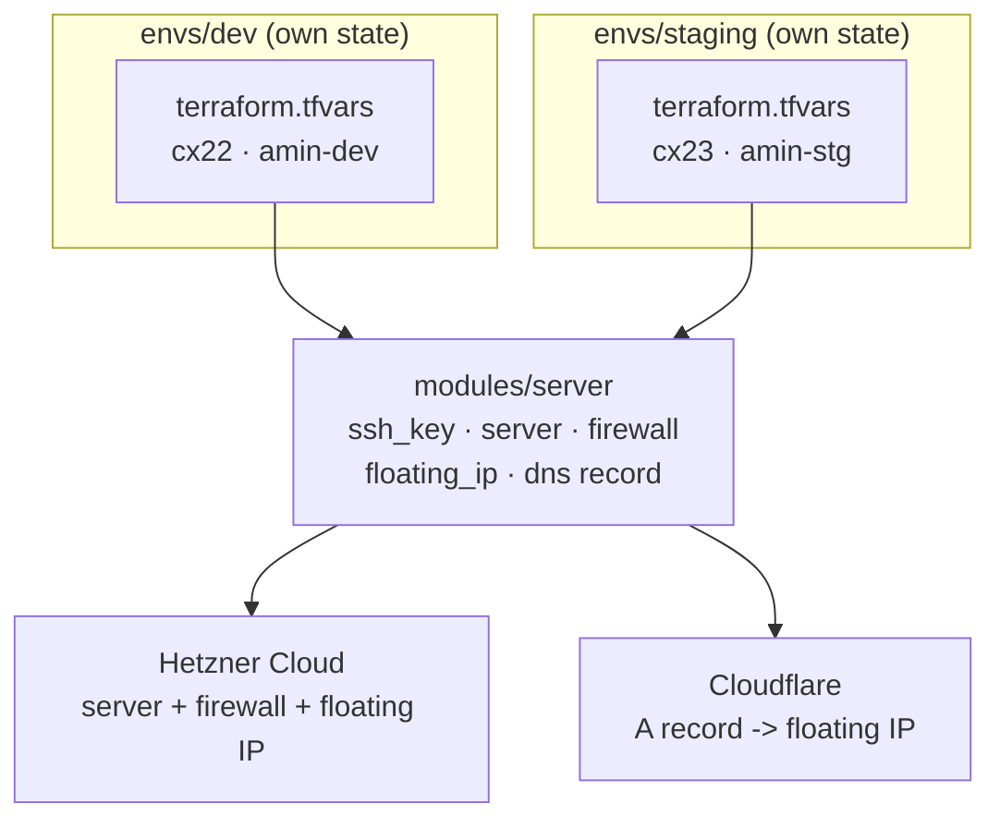

# Day 2 — Modularized dev/staging

Two environments, one module: [`modules/server`](./modules/server) holds the shared infra (SSH key, server, firewall, floating IP, Cloudflare DNS record); [`envs/dev`](./envs/dev) and [`envs/staging`](./envs/staging) are thin roots that call it with different sizing. Full build narrative in [JOURNAL.md](./JOURNAL.md).

## Architecture



Dev and staging each get their own copy of every resource in the module — nothing is shared at the infrastructure level, and nothing in one environment's state references the other.

## Run it

1. Prereqs: Terraform >= 1.5.0, an ed25519 keypair, a Hetzner API token, a Cloudflare API token scoped to **Zone → DNS → Edit** on the target zone, and that zone's ID.
2. Pick an environment: `cd envs/dev` or `cd envs/staging`.
3. Copy `terraform.tfvars.example` to `terraform.tfvars` (gitignored, never commit it) and fill it in:
   ```
   server_name = "..."
   server_type = "cx22"          # dev is a toy; staging uses a bigger type for load testing
   server_image = "ubuntu-24.04"
   server_location = "fsn1"

   hcloud_token         = "..."
   my_ip                = "<your public IP>"
   cloudflare_zone_id   = "..."
   cloudflare_api_token = "..."

   dns_record_name = "..."
   ssh_key_name    = "..."
   firewall_name   = "..."
   ```
4. **Set your own SSH key.** `ssh_key_public` isn't wired to `terraform.tfvars` yet — it's hardcoded in `main.tf` (both envs) to my key. Open `envs/<env>/main.tf` and replace the `ssh_key_public` value on the `module "web_server"` block with your own `~/.ssh/id_ed25519.pub` contents before applying, or you won't have a way in. (Tracked as follow-up in the journal — this should become a variable.)
5. `terraform init`
6. `terraform plan` — review before applying.
7. `terraform apply` — provisions SSH key, server, firewall, floating IP + assignment, and the DNS record; cloud-init binds the floating IP on first boot automatically.
8. `terraform output server_ip` — the address to hit (also what the DNS record points to).
9. `terraform destroy` — tears that environment back down to zero.

Dev and staging are fully independent state — running `apply`/`destroy` in one never touches the other. To change what both environments provision, edit `modules/server`; to change how big or how they're named, edit each env's `terraform.tfvars`.

## Adding a third environment

The whole point of the module split — a new environment is a copy, not a rewrite:

1. `cp -r envs/staging envs/<name>` (or `envs/dev`, whichever sizing is closer).
2. Edit `envs/<name>/terraform.tfvars`: unique `server_name`, `dns_record_name`, `ssh_key_name`, `firewall_name` (Hetzner and Cloudflare will collide or reject duplicates otherwise), and `server_type` sized for what this environment needs.
3. `cd envs/<name> && terraform init && terraform apply`.

Nothing in `modules/server` needs to change, and no existing environment's state is touched.

## Cost per environment

Hetzner Cloud, `fsn1`, prices as of Aug 2026 — verify current numbers at [hetzner.com/cloud](https://www.hetzner.com/cloud) before relying on this for budgeting, they move:

| Item | Dev (cx22) | Staging (cx23) |
|---|---|---|
| Server | ~€3.79/mo | ~€5.49/mo |
| Primary IPv4 | €0.50/mo | €0.50/mo |
| Floating IPv4 | €3.00/mo | €3.00/mo |
| **Total** | **~€7.29/mo** | **~€8.99/mo** |

Both environments together: ~€16/mo. Cloudflare DNS is free on the free plan. Excludes VAT.
