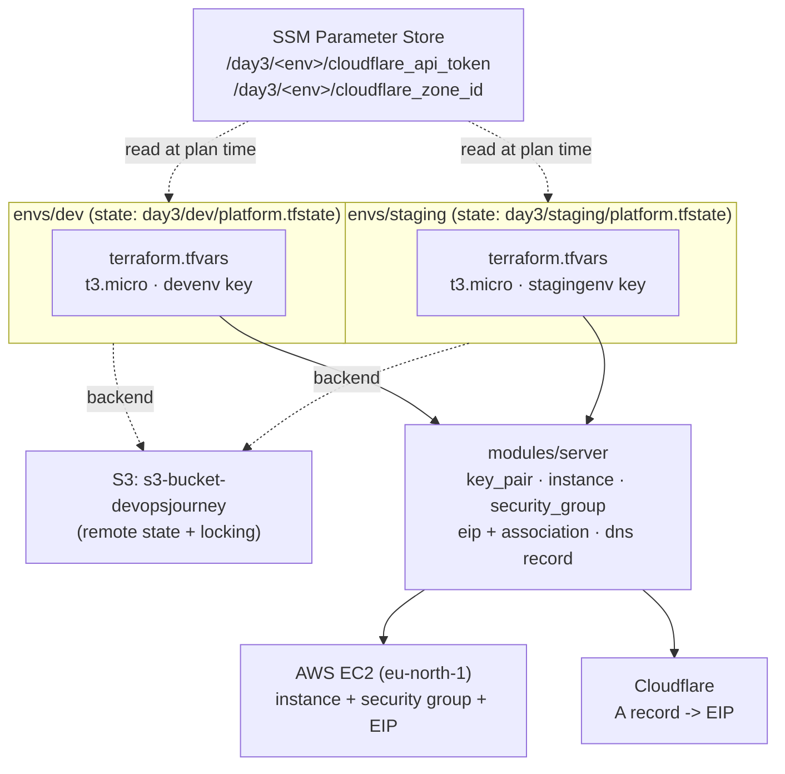

# Day 3 — Migrated to AWS

Same shared module as day2, re-platformed onto AWS: [`modules/server`](./modules/server) now provisions an EC2 key pair, `aws_instance`, security group, Elastic IP + association, and the Cloudflare DNS record; [`envs/dev`](./envs/dev) and [`envs/staging`](./envs/staging) are thin roots that call it with different sizing. State moved off local disk into a shared S3 backend, and Cloudflare secrets moved out of `terraform.tfvars` into SSM Parameter Store. Full build narrative in [JOURNAL.md](./JOURNAL.md); one-time manual setup (S3 bucket + SSM parameters) in [BOOTSTRAP.md](./BOOTSTRAP.md).

## Architecture



Dev and staging each get their own EC2 key pair, instance, security group, and EIP — nothing is shared at the infrastructure level, and (as of this round) nothing in one environment's state references the other.

## Run it

1. Prereqs: Terraform >= 1.10 (native S3 state locking via `use_lockfile`), an ed25519 keypair, AWS credentials with access to `s3-bucket-devopsjourney` and the `/day3/*` SSM parameters, and a Cloudflare zone ID.
2. One-time only, if not already done: create the S3 backend bucket and the four SSM parameters — see [BOOTSTRAP.md](./BOOTSTRAP.md) for the exact commands. These can't be created by Terraform itself because `terraform init` needs the bucket to already exist.
3. Pick an environment: `cd envs/dev` or `cd envs/staging`.
4. Create `terraform.tfvars` (gitignored, never commit it) with:
   ```
   server_name     = "..."
   server_type     = "t3.micro"      # instance size; bump for staging if load-testing
   server_image    = "24.04"         # Ubuntu release looked up via aws_ami data source
   server_location = "eu-north-1a"   # availability zone

   my_ip = "<your public IP>"        # locks down SSH (port 22) to just you

   dns_record_name = "..."
   ssh_key_name     = "..."          # must be unique per env — see note below
   firewall_name    = "..."
   ssh_key_public   = "ssh-ed25519 ..."
   ```
   `cloudflare_zone_id` and `cloudflare_api_token` are **not** set here — they're read from SSM at plan time (see below).
5. **Give each environment its own `ssh_key_name`.** Both envs set `create_ssh_key = true` and register their own AWS key pair — `devenv` for dev, `stagingenv` for staging. Don't point two environments at the same name; AWS key pair names must be unique per account/region, and reusing one recreates the cross-env dependency this setup deliberately avoids (see JOURNAL.md).
6. `terraform init` — this is also what wires up the S3 backend (`bucket = "s3-bucket-devopsjourney"`, `key = "day3/<env>/platform.tfstate"`, `region = "eu-north-1"`).
7. `terraform plan` — review before applying. Confirm the `cloudflare_api_token`/`cloudflare_zone_id` SSM reads succeed here; an `AccessDenied` at this step means your AWS identity is missing `ssm:GetParameter` on `/day3/<env>/*`.
8. `terraform apply`.
9. `terraform output server_ip` — the Elastic IP address (also what the DNS record points to).
10. `terraform destroy` — tears that environment back down to zero. Destroying one environment does not touch the other's key pair, instance, or state.

## Adding a third environment

1. `cp -r envs/staging envs/<name>` (or `envs/dev`, whichever sizing is closer).
2. Edit `envs/<name>/terraform.tfvars`: unique `server_name`, `dns_record_name`, `ssh_key_name`, `firewall_name` (AWS and Cloudflare will collide or reject duplicates otherwise).
3. Update the backend `key` in `envs/<name>/main.tf` to `day3/<name>/platform.tfstate` — every environment needs its own state key, or two envs will silently share (and clobber) one state file.
4. Create that environment's two SSM parameters (`/day3/<name>/cloudflare_api_token`, `/day3/<name>/cloudflare_zone_id`) per BOOTSTRAP.md.
5. `cd envs/<name> && terraform init && terraform apply`.

Nothing in `modules/server` needs to change, and no existing environment's state is touched.

## Notes / open items

- AWS CLI in this setup is currently authenticated as the account root user — fine for solo learning, but should become a scoped IAM role/user before adding CI or another collaborator.
- The S3 bucket and SSM parameters are bootstrapped manually and on purpose (see BOOTSTRAP.md) — they exist before Terraform can run against them, so they're outside Terraform's own state.