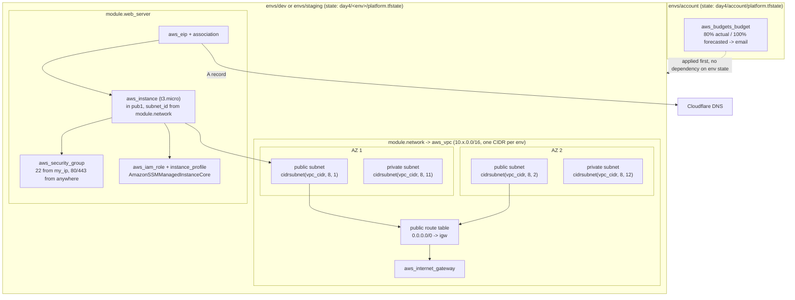

# Day 4 — VPC, subnets, IAM role, budget alarm

First real AWS-native networking: [`modules/network`](./modules/network) builds a VPC with public and private subnets across two AZs, an internet gateway, and public route table; [`modules/server`](./modules/server) (carried over from day3) now launches its `aws_instance` into that VPC instead of an AWS default VPC, and gets its own IAM role + instance profile (`AmazonSSMManagedInstanceCore`) so it's reachable via SSM Session Manager without opening SSH to the world. [`envs/account`](./envs/account) is a standalone root that creates an AWS Budgets alarm — apply this one first, before any billable resource exists. [`envs/dev`](./envs/dev) and [`envs/staging`](./envs/staging) each call both `modules/network` and `modules/server` with their own VPC CIDR, so the two environments' networks can never overlap. State and secrets carry over from day3 unchanged: S3 backend (`s3-bucket-devopsjourney`), Cloudflare API token via SSM + `direnv`. Full build narrative in [JOURNAL.md](./JOURNAL.md).

## Architecture



Each environment gets its own VPC, its own `/16` CIDR, and its own two-AZ public/private subnet layout — nothing at the network level is shared between `dev` and `staging`. The instance sits in a public subnet (this is a POC — a private-subnet + NAT/bastion layout is the natural next step, not done here) and reaches AWS APIs (SSM) through its IAM instance profile rather than through open inbound SSH.

## Run it

1. Prereqs: same as day3 — Terraform >= 1.10, `direnv` installed and hooked in, an ed25519 keypair, AWS credentials with access to `s3-bucket-devopsjourney` and the `/day3/<env>/cloudflare_api_token` + `/day3/<env>/cloudflare_zone_id` SSM parameters, a Cloudflare zone ID. Day4 doesn't bootstrap anything new — no new BOOTSTRAP.md — it reuses day3's S3 bucket and SSM parameters as-is (same Cloudflare token, no reason to duplicate it per day).
2. **Set the budget alarm first**, per the day's own brief — don't create anything billable before this exists:
   ```
   cd envs/account
   terraform init
   terraform apply
   ```
   `terraform.tfvars` here needs `budget_email`, `budget_name`, `budget_limit` (USD/month). Notifies at 80% actual spend and 100% forecasted spend.
3. Pick an environment: `cd envs/dev` or `cd envs/staging`.
4. **`direnv allow`.** Reads `/day3/<env>/cloudflare_api_token` and `/day3/<env>/cloudflare_zone_id` from SSM and exports them — `CLOUDFLARE_API_TOKEN` (read natively by the Cloudflare provider) and `TF_VAR_cloudflare_zone_id`. Skip this and every plan/apply fails on Cloudflare auth, not Terraform.
5. `terraform.tfvars` needs, in addition to the day3 server fields (`server_name`, `server_type` — e.g. `t3.micro`, `server_image` — Ubuntu release like `24.04`, `dns_record_name`, `ssh_key_name`, `firewall_name`, `ssh_key_public`, `my_ip`):
   ```
   vpc_name = "..."          # e.g. "day4-dev-vpc"
   vpc_cidr = "10.0.0.0/16"  # give dev and staging different /16s — see JOURNAL.md
   ```
6. `terraform init && terraform plan` — review before applying.
7. `terraform apply`.
8. `terraform output` — `server_ip` (the EIP, also what the DNS record points to), `vpc_id`, `public_subnet_ids`.
9. `terraform destroy` — tears the environment back down. Doesn't touch the other environment or the account budget alarm.

## Notes / open items

- `envs/staging`'s `.envrc` previously pointed at dev's SSM parameters (`/day3/dev/...`) instead of its own — fixed to `/day3/staging/...`. Worth double-checking any new env's `.envrc` matches its own name, not a copy-pasted neighbor's.
- Subnet CIDRs inside `modules/network` are derived from each env's own `vpc_cidr` via `cidrsubnet()`, not hardcoded — see [JOURNAL.md](./JOURNAL.md) for why that matters once two environments have distinct VPC ranges.
- The EC2 instance sits in the public subnet with a public EIP; the private subnets exist (for the free-tier VPC shape) but nothing is placed in them yet.
- AWS CLI is still authenticated as the account root/admin user, carried over from day3 — same open item, still not addressed.
